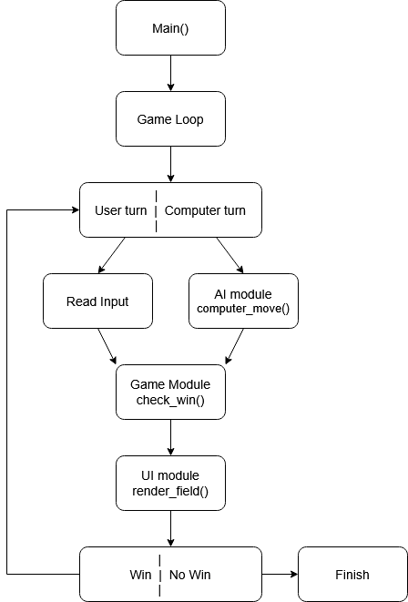

# Introduction

The project is a terminal based implementation of a Gomoku game. The goal of the game is to align 5 tiles in a row before your opponent does. The game supports playing against another human and playing against computer possibilities. The player controls the cursor and makes a move with a keyboard input. The computer uses heuristic algorithm to make a move. It tries all possible moves and scores them to select the best. Scoring is done via evaluating every possible 5 cell window.

The goal of the project is to combine terminal UI handling, game state management and AI opponent into a single rust application while maintaining performance and responsiveness.

# Requirements

The game supports:

- A 15x15 game board represented with 2D array (the size is adjustable in `config.rs`)

- 2 Game modes
  - Player vs Player
  - Player vs Computer

- Keyboard controls:
  - Arrow keys for movement
  - Enter/Space to place a tile
  - u/U to undo (only in computer mode)
  - ESC to exit

- Win detection for 5 tiles in a row
  - Horizontal
  - Vertical
  - Diagonal

- Computer opponent with configurable difficulty level (0-9)

- Terminal rendering with colored output and highlighting

- Move history tracking for undo functionality

# Design diagram

# Design choices

**1. Heuristic AI** - Computer opponent uses scoring based evaluation instead of a full search tree.

- Good performance with low computational cost.

**2. Candidate move filtering** - only cells near already placed tiles are evaluated

- restricts move search space to improve performance

**3. Sliding window** - the computer scores moves based on sliding window evaluation instead of streaks

- with streak computer doesn’t see this sequence as a potential thread `XX_XX`, it sees it as 2 separate sequences

- if evaluating with sliding window computer sees that these 4 `X`s could belong to one sequence and makes a move accordingly

# Dependencies and what they're used for

**1. crossterm:**

- keyboard input handling
- screen clearing
- colored outputs

**2. clap:**

- command line argument parsing (used for selection of mode and difficulty level)

**3. rand**

- random selection between equally good computer moves

# Evaluation

## What went well?

- Strong and efficient algorithm for making computer moves
- Terminal UI made using low level controls
- Modular structure made project easier to extend

## What went not so well?

- Increased development time compared to other languages
- First AI implementation had some flows. I could manage to come up with a strategy how to win it every time even on the most difficult level. So the algorithm had to be adjusted.

## How does implementing a bigger project in Rust feel compared to other languages?

Compared to higher level programming languages such as Python and JavaScript, implementing project of this size in Rust requires more time and effort while developing but less time for debuging because of Rust's compile time correctness checkers.

Compared to C/C++, Rust provided similar performance with more memory safety and less runtime errors. However to achieve that it used new concepts that don’t exist in other programming languages witch took some time to get used to.
